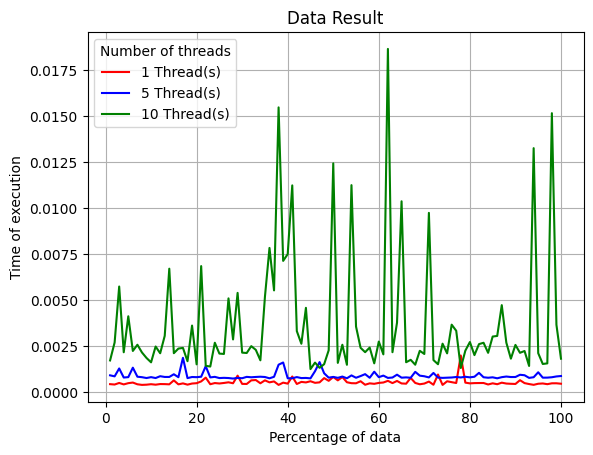

# Threaded and Sequential Prime Number Calculation and Analysis

This project entails the calculation of prime numbers using both multi-threaded and sequential approaches, along with an analysis of the performance of each method.

## Implementation Details

### `Main.java`

This file orchestrates the multi-threaded prime number calculation and manages file input/output operations. Leveraging Java's Thread class, it spawns multiple threads, each tasked with processing a segment of the input file. Post-calculation records the prime numbers discovered by each thread in the output file (Prime_numbers.txt) and logs the processing time of each thread in the time_analyses.txt file.

- Determines the number of lines in the input file.
- Spawns multiple threads, distributing the workload evenly.
- Each thread processes a distinct portion of the input file to identify prime numbers.
- Records the prime numbers found by each thread and their processing time.
- Employs synchronization mechanisms for secure write operations to the time_analyses.txt file.

### `MyRunnable.java`

This file encapsulates the MyRunnable class, representing the task executed by each thread. Within this task, each thread reads a segment of the input file, applies the trial division algorithm to identify prime numbers, and logs the elapsed time for processing a subset of lines in the time_analyses.txt file.

- Defines the task executed by individual threads.
- Reads a portion of the input file and identifies prime numbers.
- Records the processing time for each subset of lines in the time_analyses.txt file.
- Utilizes the trial division algorithm for prime number identification.

### `Trial_division_algorithm.java`

This file houses the trial division algorithm implementation, which serves as the primary method for prime number validation utilized by each thread.

- Implements the trial division algorithm, a straightforward method for prime number validation.
- The project aims to showcase the efficiency of multi-threading in prime number calculation while offering insights into individual thread performance through time analysis. Multi-threading enables parallel processing, thereby reducing overall computation time compared to a single-threaded approach.

## Prime Number Checking Algorithms

There exist various algorithms for prime number validation, including:

- **Trial Division:** A straightforward method involving checking divisibility by integers up to the square root of the number.
- **Miller-Rabin Primality Test:** A probabilistic algorithm offering high efficiency for large numbers.
- **AKS Primality Test:** A deterministic algorithm with polynomial time complexity.
- **Solovay-Strassen Primality Test:** Another probabilistic algorithm akin to Miller-Rabin.

In this project, the <b>*Trial Division algorithm*</b> is utilized.

## How to run this code

To obtain the final graph, just run `bash run.sh`, this code will compile the `Main.java`, and run the code through 1 to 100 percent of data for the three variations of threads, 1, 5 and 10. Finally, it will run the python code `python_analyses.py` to create the graph.

## Algorithm Complexity (Big O notation)

The Trial Division algorithm, employed in the final solution, demonstrates a complexity of **O(n * sqrt(n))**. This complexity stems from the algorithm's inherent **O(sqrt(n))** complexity per element, which is then multiplied by the total number of elements, **n**. While this complexity is not negligible, it might not warrant the parallelization of the algorithm due to its manageable scale.

## Time Analyses

The following image illustrates the project's execution, depicting variations in data usage from 1 to 100 percent alongside changes in the thread count.

## Conclusions

Upon analysis, it was determined that the time invested in thread creation and management for the parallel approach did not yield significant improvements over the sequential method. This suggests that the problem scale does not warrant the overhead of parallelization, rendering the sequential approach sufficient for problem resolution without the need for parallelization.
